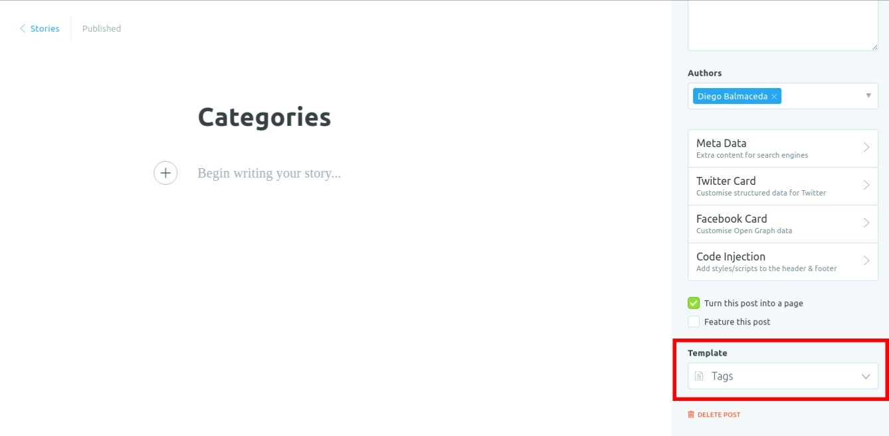
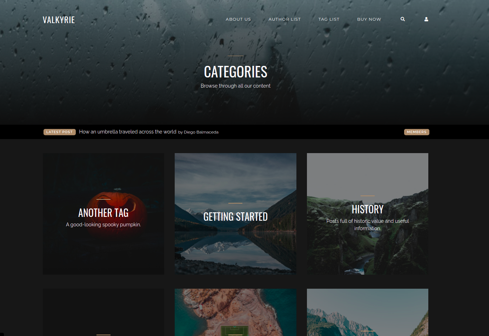
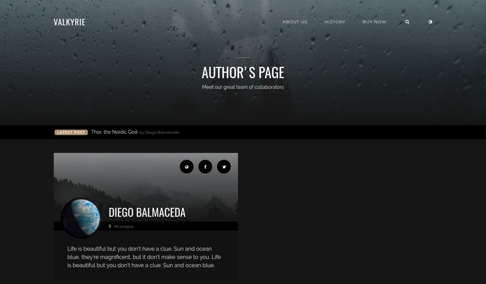
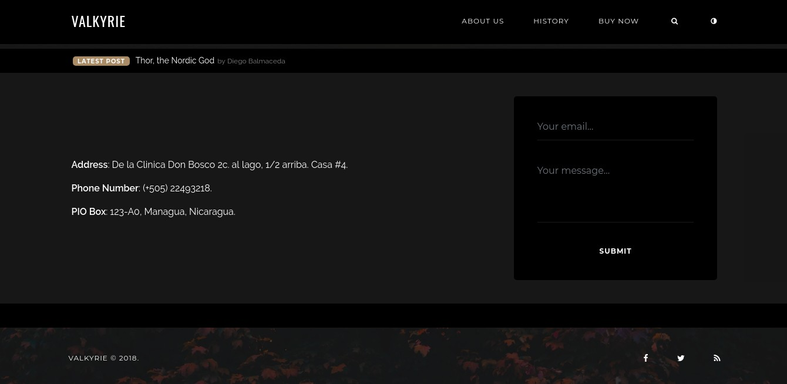

Valkyrie comes with three additional types of custom templates: **Author List**, **Tag List** and **Contact Form**. Both type of pages are used to provide a full list of author / tags automatically and they don't require to do any modification to the theme itself. To display such lists on your website, follow these steps:

- Create a new post on your blog, and turn it into a Page.

- Select the type of template you want (Author, Tag or Contact Form):

- Put a title and description to your new page. If a cover image is not provided, Valkyrie will use a pattern image by default.

- Publish it.

## Categories Page

This is how the categories (tags) page looks like. A paginated list of all the categories with at least one post.

## Authors Page

This is how the authors page looks like. A paginated list of all the authors with at least one post.

## Contact Form

If you need an static contact form you can create a page with **Contact Form** selected as custom template. The form itself does not have functionality, but if you want to, I recommend to use: [Formspree](https://formspree.io/). You are able to use everything you normally use on a page, but limit yourself to use text only.

